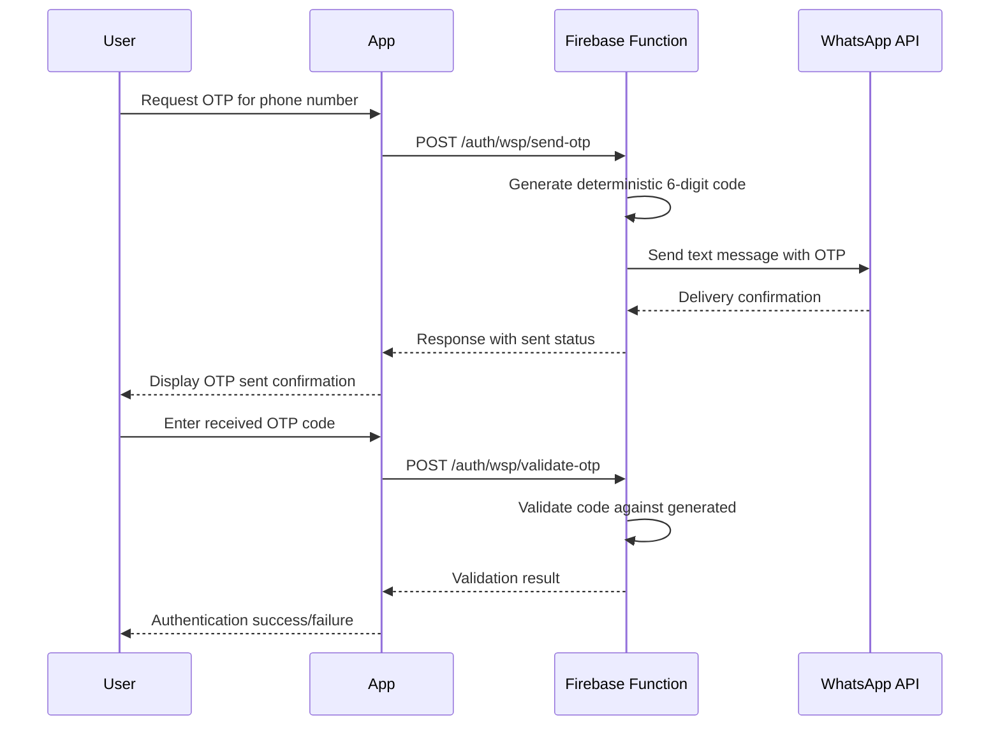

# WhatsApp OTP Documentation

This document describes the WhatsApp OTP (One-Time Password) functionality implemented in the Firebase Functions.

## API Endpoints

The WhatsApp OTP service provides two main endpoints:

### 1. Send OTP

**Endpoint:** `POST /auth/wsp/send-otp`

**Description:** Generates and sends a 6-digit OTP code to the specified phone number via WhatsApp.

**Request Body:**
```json
{
  "to": "+1234567890"
}
```

**Response:**
```json
{
  "to": "+1234567890",
  "sent": true,
  "whatsapp": {
    "status": 200,
    "body": "..."
  }
}
```

**Error Response (if WhatsApp not configured):**
```json
{
  "to": "+1234567890",
  "sent": false,
  "reason": "whatsapp_not_configured"
}
```

### 2. Validate OTP

**Endpoint:** `POST /auth/wsp/validate-otp`

**Description:** Validates the provided OTP code against the one generated for the phone number.

**Request Body:**
```json
{
  "to": "+1234567890",
  "code": "123456"
}
```

**Response (Valid):**
```json
{
  "valid": true
}
```

**Response (Invalid):**
```json
{
  "valid": false
}
```

## cURL Examples

### Send OTP

```bash
curl -X POST https://us-central1-llaapp-e2c96.cloudfunctions.net/llaapp/auth/wsp/send-otp \
  -H "Content-Type: application/json" \
  -d '{"to": "+1234567890"}'
```

### Validate OTP

```bash
curl -X POST https://us-central1-llaapp-e2c96.cloudfunctions.net/llaapp/auth/wsp/validate-otp \
  -H "Content-Type: application/json" \
  -d '{"to": "+1234567890", "code": "123456"}'
```

## Sequence Diagram



## Implementation Details

- OTP codes are generated using a deterministic hash function based on the phone number and a secret.
- Codes are 6 digits long and expire implicitly (no explicit expiration).
- WhatsApp integration requires `WHATSAPP_BEARER` environment variable to be set.
- The service uses Meta's WhatsApp Business API for sending messages.
